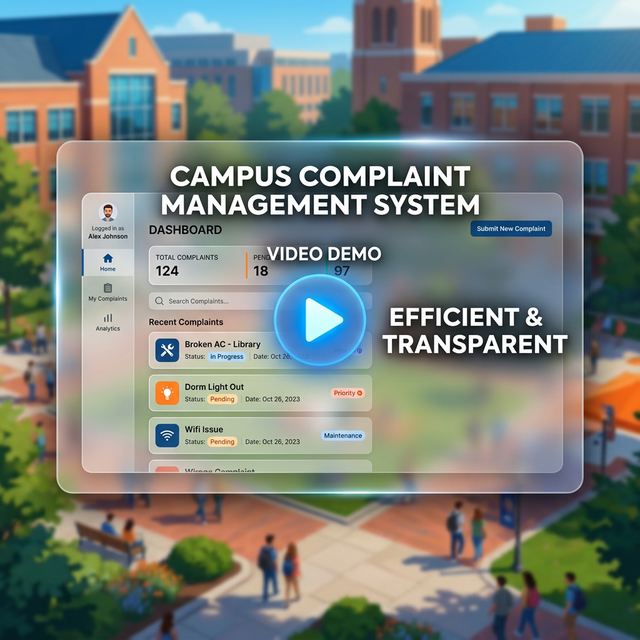
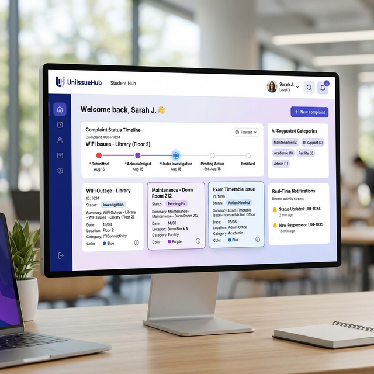
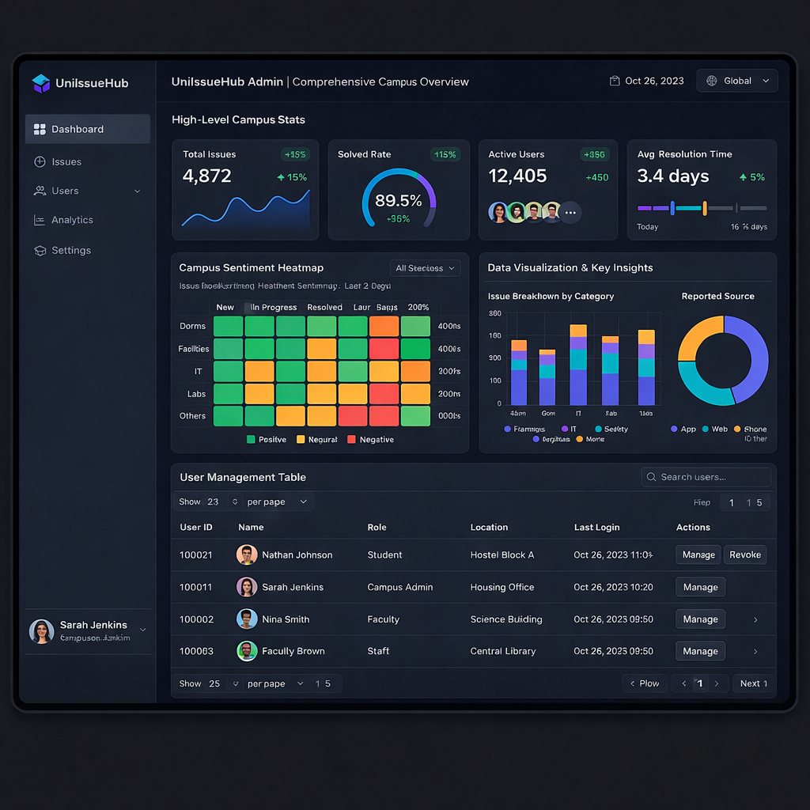

<div align="center">


<br/>


# 🎓 UniIssueHub

### AI-Powered Campus Complaint Management & Resolution Platform

[](#)

[](#)
[](#)
[](#)
[](#)
[](#)
[](#)
[](#)

<br/>

> **UniIssueHub** completely digitizes the campus complaint pipeline — from student submission to technician resolution — powered by a **custom-built NLP/AI engine** that auto-categorizes, auto-prioritizes, detects duplicates, and analyzes sentiment in **real-time**, all without any paid API.

<br/>

| 🧠 8 AI Pillars | ⚡ Real-Time WebSockets | 🎨 Premium Dark/Light UI | 🔐 4-Role RBAC |
|:---:|:---:|:---:|:---:|
| Naive Bayes + TF-IDF + Keyword Scoring | Socket.io per-user rooms | Glassmorphism + animations | Student · Admin · Warden · Technician |

</div>

<br/>

## 📺 Product Walkthrough

<div align="center">
  <a href="https://github.com/atul-upadhyay-7/complaint-system/raw/main/demo.mp4">
    
  </a>
  <p><i><b>Autoplay Preview:</b> Real-time AI Categorization & Technician Workflow. <a href="https://github.com/atul-upadhyay-7/complaint-system/raw/main/demo.mp4">Click here to watch the full 6-min walkthrough.</a></i></p>
</div>

---


## 🎯 The Purpose & Vision

### The Problem: "The Administrative Black Hole"
In most modern campuses, student complaints are a point of friction. Students submit issues via fragmented channels (WhatsApp, paper, or basic forms) and then wait in **silence**. Without transparency, students feel unheard, and without automation, administrators are overwhelmed by manual categorization, duplicate reports, and a lack of situational awareness.

### The Solution: UniIssueHub
**UniIssueHub** was engineered to Bridge the gap between campus administration and students. Our purpose is to turn **raw frustration into structured data and swift action**. By leveraging a **Local AI Ecosystem**, we've built a system that doesn't just "track" issues—it **understands** them.

| Feature | Yesterday (Legacy Manual) | Today (UniIssueHub AI) |
|---|---|---|
| **Categorization** | Manual sorting by busy admins | **Instant AI Auto-Tagging** (Bayes) |
| **Prioritization** | First-come, first-served (or squeakiest wheel) | **Urgency-First weighted AI scoring** |
| **Transparency** | Black hole — "We'll look into it" | **Live Resolution Timeline + ETAs** |
| **Efficiency** | Redundant work on duplicate reports | **TF-IDF Duplicate Audit System** |
| **Insights** | Anecdotal "vibe" of the campus | **Deep Aggregate Sentiment Heatmaps** |

---

## 🏆 Why This Project Stands Out

| 🤖 **Custom AI Engine** | Built a full NLP pipeline using `natural` — Naive Bayes classifier + TF-IDF similarity + weighted keyword scoring. **Zero paid APIs.** | Proves real ML understanding, not just API wrapping |
| 🚀 **Futuristic UX** | World-class Landing Page + **Command Palette (Ctrl+K)** + Framer Motion page transitions. | Creates a premium, app-like experience for judges |
| 🧠 **8 AI Features** | Auto-categorization, Priority, Sentiment, ETA, Duplicates, Live UI, Admin Analytics, Technical Protocols | End-to-end intelligent automation |
| 📡 **True Real-Time** | Socket.io with user-specific rooms + toast notifications + live bell counter | No polling, instant push updates |
| 💎 **Production-Grade UI** | Glassmorphism, animated particles, gradient headings, color-coded cards, dual themes | Not a prototype — a shippable product |
| 🧩 **Clean Architecture** | MVC pattern, service layer, middleware chain, async error handling, audit trail | Industry-standard code organization |
| 📬 **Async Email Pipeline** | Fire-and-forget Nodemailer — never blocks HTTP response | Real-world reliability pattern |
| 🛡️ **Enterprise Security** | JWT + bcrypt + Helmet + rate limiting + role middleware on every route | Production security posture |
| 🐳 **Docker-Ready** | Full orchestration stack — build and run the entire 3-tier system with one command. | Built for modern cloud deployment |
| 🛠️ **CI/CD Pipeline** | Automated GitHub Actions for syntax validation, build integrity, and audit. | Professional engineering standards |

---

## 🛠️ DevOps & Infrastructure

This project is engineered for **High Availability** and **Cloud Portability**. We don't just ship code; we ship a complete, reproducible infrastructure.

### 🏗️ Architecture Overview

UniIssueHub follows a modern **3-Tier Architecture**:
1. **Frontend**: React (Vite) Single Page Application.
2. **Backend**: Node.js/Express API with Socket.io for real-time events.
3. **Database**: MongoDB (Local for Dev / Atlas for Prod).

---

### 📦 Docker Orchestration

The project includes a `docker-compose.yml` for unified management.

#### Spin up the entire stack:
```bash
docker-compose up --build
```

#### Services included:
- **`backend`**: Exposed on port `5000`
- **`frontend`**: Exposed on port `5173`
- **`mongodb`**: Internally connected (no port exposed to host for security)

---

### 🚀 Production Deployment

- **Backend (Render)**: `atul-upadhyay-7/EliteCoderHackathon/backend`
- **Frontend (Vercel)**: `atul-upadhyay-7/EliteCoderHackathon/frontend` (linked with `VITE_API_URL`)

---

### 🛡️ CI/CD Pipeline

We use **GitHub Actions** (`.github/workflows/ci.yml`) for:
- **Syntax Validation**: Ensures no broken JS/JSX.
- **Build Integrity**: Verifies the frontend builds without errors.
- **Audit**: Checks dependencies for known vulnerabilities.

---

## 🤖 AI Engine — Deep Dive

> Our AI runs **100% locally** using the [`natural`](https://github.com/NaturalNode/natural) NLP library. Zero cost. Zero latency. Works offline.

### Architecture

```
Student types complaint
        │
        ▼
┌───────────────────────────────────────────────────┐
│            /api/complaints/ai-suggest             │
│                  (live endpoint)                   │
├───────────────────────────────────────────────────┤
│                                                   │
│  ┌──────────────┐   ┌───────────────────────┐     │
│  │ Pass 1:      │   │ Pass 2:               │     │
│  │ Keyword Scan │──▶│ Naive Bayes Fallback  │     │
│  │ (100+ terms) │   │ (200+ training docs)  │     │
│  └──────┬───────┘   └───────────┬───────────┘     │
│         │                       │                 │
│         ▼                       ▼                 │
│  ┌──────────────────────────────────────────────┐ │
│  │        Category Detected → Auto-Route        │ │
│  └──────────────────────────────────────────────┘ │
│                                                   │
│  ┌──────────────┐   ┌───────────────────────┐     │
│  │ 60+ Weighted │   │  Sentiment & Urgency  │     │
│  │ AI Scoring   │──▶│  Frustration Scoring  │     │
│  └──────┬───────┘   └───────────┬───────────┘     │
│         │                       │                 │
│         ▼                       ▼                 │
│  ┌──────────────────────────────────────────────┐ │
│  │   Priority & Mood: Critical / Frustrated     │ │
│  └──────────────────────────────────────────────┘ │
│                                                   │
│  ┌──────────────┐   ┌───────────────────────┐     │
│  │  Resolution  │   │  TF-IDF Cosine        │     │
│  │  ETA Engine  │   │  Similarity vs DB     │     │
│  └──────┬───────┘   └───────────┬───────────┘     │
│         │                       │                 │
│         ▼                       ▼                 │
│  ┌──────────────┐   ┌───────────────────────┐     │
│  │ AI Protocol: │   │  Duplicate Warning    │     │
│  │  Technical   │   │  is flagged in DB     │     │
│  │  Directions  │   └───────────────────────┘     │
│  └──────────────┘                                 │
└───────────────────────────────────────────────────┘
        │
        ▼
        ┌──────────────────────────────────┐
        │        THE RECIPIENTS            │
        ├──────────────────────────────────┤
        │ 🎓 Student: Live ETA & Warning   │
        │ 🛡️ Admin: Mood Analytics         │
        │ 🏠 Warden: Urgency Badges        │
        │ 🔧 Technician: Repair Protocol   │
        └──────────────────────────────────┘
```

### The 8 AI Pillars

| # | Pillar | Technique | Impact |
|---|---|---|---|
| 1 | **Auto-Categorization** | Two-pass: Keyword scan (150+ terms) → Naive Bayes fallback | Decides routing without admin manual effort |
| 2 | **Auto-Prioritization** | Weighted keyword scoring (80+ terms) + urgency amplifiers | Ensures safety-critical issues bypass the queue |
| 3 | **Sentiment Analysis** | Frustration word classification + intensity scoring | Admin can see the collective "mood" of the campus |
| 4 | **Resolution ETA** | Category × Priority matrix (32 unique timeframes) | Manages student expectations, reducing stress |
| 5 | **Duplicate Detection** | TF-IDF vectorization + Cosine similarity (vs 50 recent) | Prevents database bloat and redundant work |
| 6 | **Live AI Suggestions** | Debounced (800ms) real-time API feedback | Acts as an intelligent companion during submission |
| 7 | **Technical Protocols** | Knowledge-based technical diagnosis mappings | Provides instant repair advice to junior staff |
| 8 | **Admin Mood Analytics** | Real-time aggregation of sentiment across issues | Predictive insight into campus satisfaction |

---

## ⚡ Key Features

### 👥 4-Role RBAC System
| Role | Capabilities |
|---|---|
| **🎓 Student** | Submit complaints with image upload, track live progress timeline, receive real-time notifications |
| **🛡️ Admin** | Full analytics dashboard (Recharts), manage all complaints, view campus-wide trends |
| **🏠 Warden** | View hostel complaints, assign technicians from dropdown, update status |
| **🔧 Technician** | View assigned work only, mark In Progress / Resolved, add admin notes |

### 📡 Real-Time Engine
- **Socket.io** with per-user rooms (`user:{id}`)
- Instant toast notifications on complaint status change
- Bell icon with live unread count badge
- Mark-all-read functionality

### 🎨 Premium UI/UX
- **Futuristic Landing Page**: High-conversion entry point with 3D-style animations and feature highlights
- **Command Palette (Ctrl+K)**: Direct-access navigation and AI command tool for power users
- **Page Transitions**: Fluid `framer-motion` transitions across every route for a seamless experience
- **Glassmorphism** design system with CSS custom properties
- **Dark ↔ Light** theme toggle (persisted to localStorage)
- Animated floating particles on login page
- Color-coded feature cards, gradient headings, micro-animations
- **EliteCoder Hackathon** badge with purple glow
- Responsive: mobile, tablet, and desktop layouts

### 📧 Async Email Notifications
- **Fire-and-forget** pattern via Nodemailer
- Never blocks HTTP response (non-blocking with `.catch()`)
- Emails sent on: complaint created, status changed, technician assigned

### 🔐 Security Stack
- JWT access tokens with role payload
- Bcrypt password hashing (10 salt rounds)
- Helmet.js security headers
- Express Rate Limiter (brute-force protection)
- Role-based middleware guards on every route

---

## 🛠️ Tech Stack

### Frontend
| Technology | Role |
|---|---|
| React 18 + Vite 5 | Component UI + lightning-fast HMR |
| Tailwind CSS + Shadcn UI | Design system + Radix primitives |
| Socket.io Client | Real-time bi-directional events |
| React Router DOM v6 | Client-side RBAC routing |
| Recharts | Analytics charts + data visualization |
| Lucide React | Modern icon system |
| React Hot Toast | Non-blocking toast notifications |
| Context API | Auth, Socket, Theme state management |

### Backend
| Technology | Role |
|---|---|
| Node.js 22 + Express.js | RESTful API server |
| MongoDB + Mongoose | Document store + schema validation |
| Socket.io | Real-time room-based broadcasting |
| `natural` (NLP library) | Naive Bayes + TF-IDF + tokenization |
| JWT + Bcrypt | Authentication + password hashing |
| Nodemailer | Async email notifications |
| Winston | Structured logging (file + console) |
| Helmet + Express Rate Limiter | Security headers + brute-force protection |

---

## 📁 Project Structure

```
EliteCoderHackathon/
│
├── backend/                          # Express.js API Server
│   ├── config/
│   │   └── db.js                     # MongoDB connection with Mongoose
│   ├── controllers/
│   │   ├── adminController.js        # Admin analytics & user management
│   │   ├── authController.js         # Register, login, password reset
│   │   └── complaintController.js    # CRUD + AI suggest endpoint
│   ├── middleware/
│   │   ├── auth.js                   # JWT verification + role authorization
│   │   ├── errorHandler.js           # Global async error handler
│   │   ├── rateLimiter.js            # Brute-force protection
│   │   └── validate.js               # Express-validator middleware
│   ├── models/
│   │   ├── Complaint.js              # Schema: title, category, priority, AI fields
│   │   ├── ComplaintHistory.js       # Audit trail: every status change logged
│   │   └── User.js                   # Schema: name, email, role, hashed password
│   ├── routes/
│   │   ├── admin.js                  # GET /stats, GET /users
│   │   ├── auth.js                   # POST /register, /login, /forgot-password
│   │   └── complaints.js             # CRUD + POST /ai-suggest
│   ├── services/
│   │   ├── aiService.js              # 🧠 NLP Engine: Bayes + TF-IDF + scoring
│   │   ├── complaintService.js       # Business logic: create, update, email
│   │   └── notificationService.js    # Socket.io event emitter
│   ├── utils/
│   │   ├── asyncHandler.js           # Async/await error wrapper
│   │   ├── logger.js                 # Winston: file + console logging
│   │   └── sendEmail.js              # Nodemailer transporter
│   ├── seed.js                       # Auto-seed demo users + sample data
│   ├── server.js                     # Entry point: Express + Socket.io init
│   └── .env.example                  # Environment variable template
│
├── frontend/                         # React + Vite SPA
│   ├── src/
│   │   ├── api/
│   │   │   └── axios.js              # Axios instance + JWT interceptor
│   │   ├── components/
│   │   │   ├── charts/
│   │   │   │   ├── CategoryPieChart.jsx  # Recharts pie chart
│   │   │   │   └── WeeklyBarChart.jsx    # Recharts bar chart
│   │   │   ├── ui/                   # Shadcn UI base components
│   │   │   │   ├── avatar.jsx
│   │   │   │   ├── badge.jsx
│   │   │   │   ├── button.jsx
│   │   │   │   ├── card.jsx
│   │   │   │   ├── dialog.jsx
│   │   │   │   ├── input.jsx
│   │   │   │   ├── label.jsx
│   │   │   │   ├── progress.jsx
│   │   │   │   ├── select.jsx
│   │   │   │   ├── separator.jsx
│   │   │   │   └── textarea.jsx
│   │   │   ├── AnimatedPage.jsx      # Framer Motion wrapper for transitions
│   │   │   ├── CommandBar.jsx        # Ctrl+K Command Palette component
│   │   │   ├── ComplaintCard.jsx      # Card with AI badges row
│   │   │   ├── ComplaintTimeline.jsx  # Progress step visualization
│   │   │   ├── DashboardStats.jsx     # Stats overview component
│   │   │   ├── NotificationBell.jsx   # Real-time bell + unread count
│   │   │   ├── ProtectedRoute.jsx     # RBAC route guard
│   │   │   ├── Sidebar.jsx            # Navigation sidebar
│   │   │   └── SkeletonCard.jsx       # Loading skeleton
│   │   ├── context/
│   │   │   ├── AuthContext.jsx        # JWT auth state + login/logout
│   │   │   ├── SocketContext.jsx      # Socket.io connection manager
│   │   │   └── ThemeContext.jsx       # Dark/light theme toggle
│   │   ├── pages/
│   │   │   ├── AdminComplaints.jsx    # Admin: manage all complaints
│   │   │   ├── AdminDashboard.jsx     # Admin: analytics + charts
│   │   │   ├── Dashboard.jsx          # Student: overview
│   │   │   ├── ForgotPassword.jsx     # Password reset request
│   │   │   ├── LandingPage.jsx        # 🚀 Elite Futuristic Entry Page
│   │   │   ├── Login.jsx              # 💎 Premium login with particles
│   │   │   ├── MyComplaints.jsx       # Student: complaint list + timeline
│   │   │   ├── Notifications.jsx      # Notification center
│   │   │   ├── Register.jsx           # Student registration
│   │   │   ├── ResetPassword.jsx      # Password reset form
│   │   │   ├── SubmitComplaint.jsx    # 🧠 AI-powered form + live panel
│   │   │   ├── TechnicianDashboard.jsx# Technician: assigned complaints
│   │   │   └── WardenDashboard.jsx    # Warden: hostel management
│   │   ├── lib/
│   │   │   └── utils.js              # Shadcn utility functions
│   │   ├── App.jsx                    # Router + RBAC wrapper
│   │   ├── main.jsx                   # React DOM entry point
│   │   └── index.css                  # Global styles + animations
│   ├── index.html
│   ├── vite.config.js
│   ├── tailwind.config.js
│   └── postcss.config.js
│
└── README.md                         # This file
```

---

## 🚀 Getting Started

### Prerequisites
- **Node.js** ≥ 18
- **MongoDB** running locally or MongoDB Atlas URI

### 1. Clone & Install

```bash
git clone https://github.com/atul-upadhyay-7/EliteCoderHackathon.git
cd EliteCoderHackathon
```

### 2. Backend Setup

```bash
cd backend
npm install
```

Create a `.env` file (copy from `.env.example`):

```env
MONGO_URI=mongodb://127.0.0.1:27017/EliteCoderHackathon
JWT_SECRET=your_super_secret_jwt_key
PORT=5000

# Email (Optional — Gmail App Password)
SMTP_EMAIL=your_email@gmail.com
SMTP_PASSWORD=your_app_password
```

```bash
npm run dev
# ✅ API running at http://localhost:5000
# ✅ AI Engine: Naive Bayes classifier trained
```

### 3. Frontend Setup

```bash
cd ../frontend
npm install
npm run dev
# ✅ UI running at http://localhost:5173
```

> **Note:** The database auto-seeds demo users and 6 sample complaints on first startup.

---

## 🔑 Demo Accounts

Click the role buttons on the login page for one-click fill:

| Role | Email | Password |
|------|-------|----------|
| 🛡️ Admin | `admin@campus.edu` | `admin123` |
| 🎓 Student | `student@campus.edu` | `student123` |
| 🔧 Technician | `tech@campus.edu` | `tech123` |
| 🏠 Warden | `warden@campus.edu` | `warden123` |

---

## 🧪 Testing the AI

### Quick Test Cases

| Test | Title to Type | Expected AI Result |
|---|---|---|
| Category: Internet | `WiFi not working in hostel` | 🌐 Internet, 🟡 Medium, ⏱️ 1-3 days |
| Category: Water | `No water supply since morning` | 💧 Water, 🟢 Low, ⏱️ 2-4 days |
| High Priority | `URGENT: No electricity since 2 days!` | ⚡ Electricity, 🔴 High, ⏱️ 4-8 hours |
| Critical + Sentiment | `Terrible food, disgusting and pathetic!` | 🍽️ Food, 🚨 Critical, 🔥 Urgent, ⏱️ 1 hour |
| Duplicate Detection | Submit same complaint twice | ⚠️ "Similar complaint found! (71% match)" |

---

## 📊 API Endpoints

### Auth
| Method | Endpoint | Description |
|--------|----------|-------------|
| POST | `/api/auth/register` | Register new student |
| POST | `/api/auth/login` | Login (returns JWT) |
| POST | `/api/auth/forgot-password` | Send reset email |
| POST | `/api/auth/reset-password/:token` | Reset password |

### Complaints
| Method | Endpoint | Description |
|--------|----------|-------------|
| POST | `/api/complaints` | Create complaint (AI auto-processes) |
| POST | `/api/complaints/ai-suggest` | Live AI analysis (real-time panel) |
| GET | `/api/complaints` | List complaints (filtered by role) |
| GET | `/api/complaints/:id` | Get single complaint |
| PATCH | `/api/complaints/:id` | Update status/assignment |
| DELETE | `/api/complaints/:id` | Delete complaint |
| GET | `/api/complaints/:id/history` | Audit trail |

### Admin
| Method | Endpoint | Description |
|--------|----------|-------------|
| GET | `/api/admin/stats` | Dashboard analytics |
| GET | `/api/admin/users` | User management |

---

## 🏆 Submission Links

| Category | Link |
|---|---|
| **GitHub Repository** | [💻 Source Code (GitHub)](https://github.com/atul-upadhyay-7/EliteCoderHackathon) |
| **Frontend App** | [🚀 Live App (Vercel)](https://complaint-system-wine.vercel.app/) |
| **Backend API** | [📡 API Server (Render)](https://complaint-system-bc1h.onrender.com/) |

---

## 🖼️ High-Res 4K UI Prototypes

Experience the UI/UX design of UniIssueHub in stunning 4K resolution.

<div align="center">
  
  <p><i><b>Landing Page:</b> Modern, high-conversion entry point.</i></p>
  <br/>
  
  <p><i><b>Student Hub:</b> Personalized dashboard with real-time status tracking.</i></p>
  <br/>
  
  <p><i><b>Admin Dashboard:</b> Comprehensive analytics and sentiment heatmaps.</i></p>
  <br/>
  
  <p><i><b>Technician Portal:</b> Streamlined task management and technical protocols.</i></p>
</div>

---

---

## 📽️ Full Video Demonstration

<div align="center">
  <a href="https://youtu.be/7yhNndCdo9s">
    
  </a>
  <p><i><b>Full Project Walkthrough:</b> AI Features, Role-based Access, and Deployment.</i></p>
</div>

---

## ️ Future Roadmap

- [ ] AI auto-assignment of technicians based on workload + specialty
- [ ] Image analysis — detect complaint category from uploaded photo
- [ ] Student satisfaction rating after resolution
- [ ] Complaint escalation rules (auto-escalate after 48h)
- [ ] Analytics export (PDF/CSV reports)
- [ ] Mobile PWA with push notifications


<div align="center">

### Built with ❤️ for a smarter campus

**EliteCoder Hackathon 2026**

Made by **Atul Upadhyay** & **Anshika**


</div>
