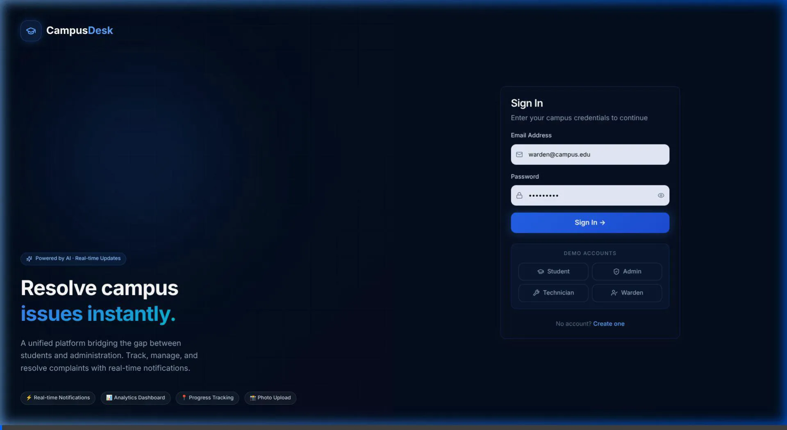

<div align="center">
  
  
  # 🎓 UniIssueHub
  **The Next-Generation Campus Complaint Management & Resolution Platform**

  [](#)
  [](#)
  [](#)
  [](#)
  [](#)
  [](#)

  <p align="center">
    Built for the <strong>EliteCoder Hackathon</strong> 🚀 &nbsp;|&nbsp; Dark & Light Mode &nbsp;|&nbsp; Real-time WebSockets
  </p>
</div>

---

## 🌟 What Makes UniIssueHub Stand Out

UniIssueHub is not just another CRUD app — it's a **fully real-time, production-grade, beautifully designed** platform that completely digitizes the campus complaint pipeline from submission to resolution.

| Feature | Description |
|---|---|
| ⚡ **Real-Time WebSockets** | Socket.io with user-specific rooms. Status changes instantly push toast notifications — no manual refresh needed. |
| 🤖 **AI Auto-Categorization** | Backend engine predicts complaint categories from description text, reducing admin overhead. |
| 💎 **Premium Dual-Theme UI** | Stunning dark & light glassmorphism design with animated floating particles, gradient headings, animated stat counters, and color-coded feature cards. |
| 📊 **Live Analytics Dashboard** | Recharts-powered admin overview with resolution rates, complaint categories, and campus-wide trends. |
| 📍 **Progress Timeline** | Students track complaints step-by-step: Submitted → Assigned → In Progress → Resolved. |
| 📸 **Image Attachments** | Drag-and-drop photo upload with base64 payload handling for photographic evidence. |
| 📧 **Async Email Notifications** | Fire-and-forget email alerts via Nodemailer on every status change — never blocks the request cycle. |

---

## 🎥 Demo


*(Login → Admin Analytics → Warden Dashboard → Technician View → Light/Dark Theme Toggle)*

---

## 🛠️ Tech Stack

### Frontend
| Technology | Purpose |
|---|---|
| **React 18 + Vite** | Lightning-fast HMR and modern component architecture |
| **Tailwind CSS + Shadcn UI** | Custom design system with Radix primitives |
| **Socket.io Client** | Real-time bi-directional events |
| **React Router DOM** | Client-side RBAC routing |
| **Recharts** | Analytics and data visualization |
| **Lucide React + React Hot Toast** | Icons, micro-animations, instant feedback |

### Backend
| Technology | Purpose |
|---|---|
| **Node.js + Express.js** | RESTful API server |
| **Socket.io** | Real-time room-based event broadcasting |
| **MongoDB + Mongoose** | Document store with linked complaint history |
| **JWT + Bcrypt** | Secure authentication and password hashing |
| **Nodemailer** | Async email notifications (fire-and-forget) |
| **Winston** | Structured request & error logging |
| **Helmet + Rate Limiter** | Production security headers |

---

## 📁 Project Structure

```text
complaint-system/
│
├── backend/                   # Node.js + Express API
│   ├── config/                # DB & environment configs
│   ├── controllers/           # Route handlers (admin, auth, complaints)
│   ├── middleware/            # JWT auth guards, role checks, error handlers
│   ├── models/                # Mongoose schemas (User, Complaint, History)
│   ├── routes/                # Express API route definitions
│   ├── services/              # Business logic (AI, email, notifications)
│   ├── utils/                 # AsyncHandler, Winston logger
│   └── server.js              # Entry point & Socket.io initialization
│
├── frontend/                  # React + Vite SPA
│   └── src/
│       ├── api/               # Axios instance & interceptors
│       ├── components/        # Sidebar, Skeleton loaders, Charts, Cards
│       │   ├── charts/        # Recharts wrappers
│       │   └── ui/            # Shadcn UI base components
│       ├── context/           # AuthContext, ThemeContext, SocketContext
│       ├── pages/             # Login, Student, Admin, Warden, Technician
│       ├── App.jsx            # Core routing & RBAC wrapper
│       └── main.jsx           # React DOM entry
│
└── README.md
```

---

## 🚀 Getting Started

### Prerequisites
- Node.js ≥ 18
- MongoDB (local or Atlas)

### 1. Backend Setup
```bash
cd backend
npm install
```

Create a `.env` file:
```env
MONGO_URI=mongodb://127.0.0.1:27017/complaint-system
JWT_SECRET=your_jwt_secret
SMTP_EMAIL=your_email@gmail.com
SMTP_PASSWORD=your_app_password
```

```bash
npm run dev
# API running at http://localhost:5000
```

### 2. Frontend Setup
```bash
cd frontend
npm install
npm run dev
# UI running at http://localhost:5173
```

> **Tip:** The database auto-seeds demo users and sample complaints on first startup.

---

## 🔑 Demo Accounts

Click the **"Demo Accounts"** buttons on the login page or use:

| Role | Email | Password |
|------|-------|----------|
| 🛡️ **Admin** | `admin@campus.edu` | `admin123` |
| 🎓 **Student** | `student@campus.edu` | `student123` |
| 🔧 **Technician** | `tech@campus.edu` | `tech123` |
| 🏠 **Warden** | `warden@campus.edu` | `warden123` |

---

## 🏗️ Core Features

### 👥 Role-Based Access Control (4 Roles)
- **Student** — Submit complaints, upload images, track live progress timeline
- **Admin** — Full analytics dashboard, manage all complaints & users
- **Warden** — View hostel complaints, assign technicians, update status
- **Technician** — View assigned work, mark In Progress / Resolved

### 🎨 Premium Login Page
- Animated floating particle dots on dark mode
- **EliteCoder Hackathon** badge with purple gradient glow
- "Live Platform · All Systems Operational" status pill
- Animated counter stats (1240+ resolved, 98% success rate, 24h response)
- 4 color-coded feature cards with icon highlights
- One-click demo account buttons
- Full dark ↔ light theme toggle

### ⚙️ Bug Fixes & Reliability (Latest Updates)
- **Fixed:** "Failed to update status" error on first click — caused by a `null` student reference in the email template crashing the server with a 500 error. Now guarded with null checks; email is skipped gracefully when student data is missing.
- **Fixed:** Technician authorization using correct MongoDB ObjectId string comparison (`toString()`).
- **Fixed:** Email sending is fully asynchronous (fire-and-forget) so it never blocks or delays status update responses.
- **Fixed:** Warden "Assign" button works correctly without auto-triggering on dropdown change.
- **Improved:** Loading states and button disabling on all status update actions to prevent double-clicks.

### 🌙 Dark & Light Theme
- CSS variable-based theme system (`data-theme` attribute)
- Persisted to `localStorage`
- All dashboards, cards, charts, and forms fully themed

### 📡 Real-Time Notifications
- Socket.io rooms per user (`user:{id}`)
- Instant toast popups on complaint updates
- Bell icon with unread count badge
- Mark-all-read functionality

---

## 🔐 Security

- JWT access tokens with role payload
- Bcrypt password hashing (salt rounds: 10)
- Helmet.js security headers
- Express Rate Limiter (brute-force protection)
- Role-based middleware guards on every protected route
- Technicians can only update complaints assigned to them

---

<div align="center">
  <i>Built with ❤️ for a better campus experience — <strong>EliteCoder Hackathon 2026</strong></i>
</div>
